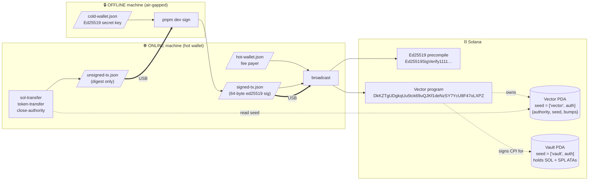
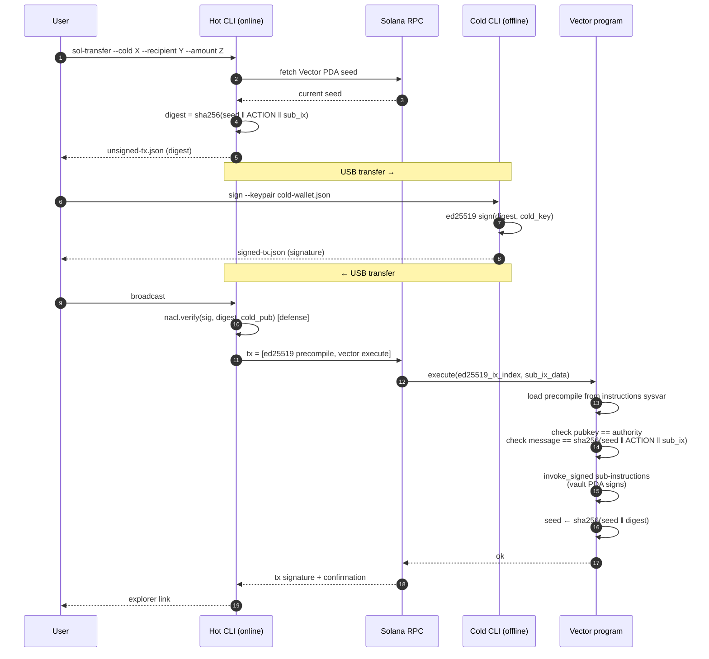

# offline-signer-cli

An offline Solana transaction signing CLI backed by a custom on-chain program
("Vector"). The cold wallet never signs a full Solana transaction — it signs
only a 32-byte digest, which is verified on-chain via the native Ed25519
precompile + instruction introspection.

This replaces the previous durable-nonce design. Durable nonces are being
deprecated; Vector uses no nonces and has no per-cluster external dependency
beyond the always-deployed Ed25519 precompile.

## Architecture

### System view



### Per-transaction sequence



### PDAs per authority

| PDA          | Seeds                       | Owner          | Holds          |
|--------------|-----------------------------|----------------|----------------|
| **Vector**   | `["vector", authority]`     | this program   | state (authority, hashchain seed, bumps) |
| **Vault**    | `["vault",  authority]`     | System program | SOL + SPL ATAs |

State and value are split because `SystemProgram.transfer` rejects a `from`
account that carries data — so SOL must live on a system-owned PDA.

## Replay protection (hashchain)

Each `execute` advances the on-chain seed:

```
digest      = SHA-256(seed || ACTION_EXECUTE || sub_ix_data)
new_seed    = SHA-256(seed || digest)
```

A pre-signed digest is bound to the seed it was computed against. Once the
seed advances, the old signature can never be replayed.

`close` uses the same scheme with `ACTION_CLOSE || close_to_pubkey`.

## On-chain program (Anchor)

Located at `programs/vector/`. Three instructions:

| Instruction  | Inputs                                     | Effect |
|--------------|--------------------------------------------|--------|
| `initialize` | —                                          | Creates state PDA; records initial seed from clock |
| `execute`    | `ed25519_ix_index: u8`, `sub_ix_data: Vec<u8>` | Verifies precompile, CPI-executes each sub-instruction with the Vault PDA as signer, advances seed |
| `close`      | `ed25519_ix_index: u8`                     | Verifies precompile, drains Vault to `close_to`, closes state PDA |

Sub-instruction wire format (consumed by `execute`):

```
[u8 num_ixs]
per ix:
  [Pubkey program_id (32B)]
  [u8 num_accounts]
  per account:
    [Pubkey (32B)]
    [u8 flags]   bit0 = is_writable, bit1 = is_signer
  [u16 LE data_len]
  [data]
```

Only the Vault PDA may be marked `is_signer` — the program signs CPIs with
the vault seeds via `invoke_signed`.

## CLI commands

```
offline-signer <command> [options] [--env devnet|mainnet|<rpc-url>]
```

| Command             | Use on  | Description                                         |
|---------------------|---------|-----------------------------------------------------|
| `init-authority`    | Hot     | Initialize Vector + Vault PDAs for a cold pubkey    |
| `sol-transfer`      | Hot     | Build an unsigned SOL transfer                      |
| `token-transfer`    | Hot     | Build an unsigned SPL-token transfer                |
| `stake-create`      | Hot     | Build an unsigned vault-funded stake-account create (auths = Vault PDA) |
| `stake-delegate`    | Hot     | Build an unsigned delegate-to-validator             |
| `stake-deactivate`  | Hot     | Build an unsigned deactivate-stake                  |
| `stake-withdraw`    | Hot     | Build an unsigned withdraw-from-stake               |
| `close-authority`   | Hot     | Build an unsigned close                             |
| `sign`              | **Cold**| Sign the digest in `unsigned-tx.json`               |
| `broadcast`         | Hot     | Assemble `[Ed25519 precompile, vector ix]` and send |

### Typical flow

```bash
# 1. Hot side: provision PDAs for the cold pubkey.
offline-signer init-authority \
  --env devnet \
  --cold <COLD_PUBKEY> \
  --payer ./hot-wallet.json

# Fund the Vault PDA (printed by init-authority) with SOL/SPL tokens.

# 2. Hot side: prepare an unsigned transfer.
offline-signer sol-transfer \
  --env devnet \
  --cold <COLD_PUBKEY> \
  --recipient <RECIPIENT_PUBKEY> \
  --amount 0.5 \
  --payer <HOT_PUBKEY>

# → writes unsigned-tx.json

# 3. Move unsigned-tx.json to the OFFLINE machine. Cold side:
offline-signer sign \
  --keypair ./cold-wallet.json \
  --unsigned ./unsigned-tx.json

# → writes signed-tx.json (a 64-byte Ed25519 signature over the digest)

# 4. Move signed-tx.json back to the ONLINE machine. Hot side:
offline-signer broadcast \
  --env devnet \
  --payer ./hot-wallet.json \
  --unsigned ./unsigned-tx.json \
  --signature ./signed-tx.json
```

### Institutional staking flow

Every stake operation funnels through the same `execute` instruction — the
cold wallet authorizes a `StakeProgram` sub-instruction signed by the Vault
PDA via CPI. The cold key never sees a blockhash.

| Concern | Where it lives |
|---|---|
| Funds | Vault PDA (`["vault", authority]`) |
| Stake / withdraw authority on every stake account | Vault PDA |
| Authorization to delegate / deactivate / withdraw | Cold-wallet Ed25519 signature over the digest |

Stake account addresses are **derived** from the Vault PDA via
`createAccountWithSeed`, so the same `--seed` string always produces the
same stake address. Pick any naming convention (e.g. `"validator-A-2026Q2"`).

```bash
# 1. Vault funds + creates a stake account; both authorities = Vault PDA.
offline-signer stake-create \
  --env devnet \
  --cold <COLD_PUBKEY> \
  --seed "validator-A-2026Q2" \
  --amount 100 \
  --payer <HOT_PUBKEY>
# → unsigned-tx.json   ... sign ... broadcast

# 2. Delegate that stake to a validator's vote account.
offline-signer stake-delegate \
  --env devnet \
  --cold <COLD_PUBKEY> \
  --stake <STAKE_PUBKEY> \
  --validator <VOTE_PUBKEY> \
  --payer <HOT_PUBKEY>
# → unsigned-tx.json   ... sign ... broadcast
# Takes effect at the next epoch boundary.

# 3. Start unwinding (deactivate); becomes withdrawable next epoch.
offline-signer stake-deactivate \
  --env devnet \
  --cold <COLD_PUBKEY> \
  --stake <STAKE_PUBKEY> \
  --payer <HOT_PUBKEY>

# 4. Withdraw inactive stake back to a recipient (e.g. the Vault PDA).
offline-signer stake-withdraw \
  --env devnet \
  --cold <COLD_PUBKEY> \
  --stake <STAKE_PUBKEY> \
  --amount 100 \
  --recipient <VAULT_PDA_OR_OTHER> \
  --payer <HOT_PUBKEY>
```

**Notes for operators:**

- Minimum delegation on most clusters is **1 SOL** above rent (≈ 0.00228 SOL
  for a 200-byte stake account). `stake-create` with less will succeed but
  `stake-delegate` will fail with Stake program error `0xc`
  (`InsufficientDelegation`).
- The cold-side `sign` UI decodes the `meta` and shows `Stake op`,
  `Stake acct`, `Validator`, `Amount`, `Recipient` so the human at the keys
  sees what they're authorizing.
- Multiple stake accounts per authority: use a distinct `--seed` for each.
  All inherit the Vault PDA as stake & withdraw authority, so one cold key
  controls the whole portfolio.
- Pre-signing: `signed-tx.json` produced offline is single-use (hashchain
  replay protection). Useful for break-glass "deactivate everything"
  procedures held in escrow.

## Setup

```bash
pnpm install
anchor build          # builds the on-chain program (target/deploy/vector.so)
anchor test           # runs the integration tests against solana-test-validator
```

### Toolchain

| Tool          | Version tested |
|---------------|----------------|
| anchor        | 0.32.1         |
| solana CLI    | 3.0.13 (Agave) |
| rustc (host)  | 1.89.0         |
| rustc (SBPF)  | 1.84.1 (platform-tools v1.51) |
| node          | 18+            |
| pnpm          | 10+            |

The `Cargo.lock` pins `proc-macro-crate`, `indexmap`, and
`unicode-segmentation` to versions compatible with platform-tools v1.51's
bundled cargo 1.84. Upgrade pins when newer platform-tools ship.

## Deploying the program

The repo ships a dev program ID
(`DkKZTgUDgkqUu5tck69uQJKf1deNzSY7YcU8F47oLXPZ`) baked into both
`declare_id!()` and `Anchor.toml`. For your own deployment:

```bash
# Generate a fresh program keypair
solana-keygen new --no-bip39-passphrase -o target/deploy/vector-keypair.json --force

# Sync the new pubkey into declare_id!() and Anchor.toml
anchor keys sync

# Update src/utils/vector.ts → VECTOR_PROGRAM_ID to the new value

anchor build
anchor deploy --provider.cluster devnet
```

## Tests

```bash
anchor test
```

Covers: initialize, SOL transfer happy path, replay rejection, SPL-token
transfer via CPI, close (with vault drain), wrong-signer rejection,
tampered-digest rejection, missing-precompile rejection.

## Security notes

- Cold wallet only signs 32-byte digests. It never produces a Solana
  transaction signature and is never asked to sign a blockhash.
- The on-chain program rejects any Ed25519 precompile that uses
  cross-instruction data references — all signature/pubkey/message bytes
  must live inside the precompile's own instruction data.
- The program enforces exactly one signature per precompile instruction.
- `is_signer = true` is allowed in sub-instructions only for the Vault PDA;
  any other signer would require a tx-level signature the cold wallet cannot
  provide.
- The hashchain initial seed mixes the slot and unix_timestamp from `Clock`
  so a close-and-reinit cycle cannot resurrect an old pre-signed digest.

